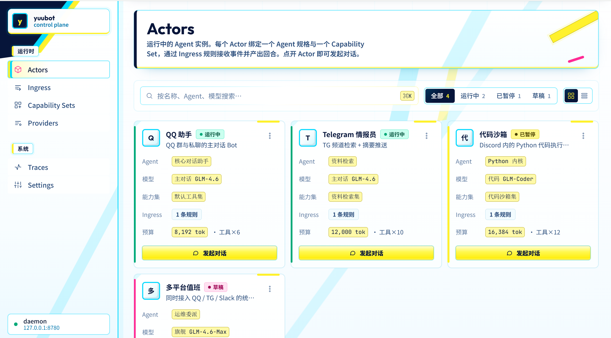

# yuubot

yuubot 是一个面向 Agent 用户的本地控制台：你可以在漂亮的 Web UI 里创建
Actors，配置模型和工具能力，然后让 Agent 在隔离的 Python 环境中执行代码、调用
外部服务，并把过程完整记录下来。



## 核心特性

### Python 执行环境

每个 Actor 都可以拥有自己的工作区和 Python session。Agent 不只是返回文本，还可以
运行 Python 代码来处理文件、分析数据、生成图表、调用 SDK，或把结果保存为可追踪的
artifact。

Python 执行适合这些场景：

- 数据清洗、计算和可视化
- 调用第三方 Python SDK
- 读写 Actor 工作区文件
- 生成图片、报表、摘要和中间产物
- 把复杂任务拆成可验证的程序步骤

### Programmatic Tool Calls

yuubot 的工具不是简单的聊天按钮，而是 Agent 可编程调用的能力集合。Capability Set
决定一个 Actor 能访问哪些工具；Agent 在需要时通过 tool call 或 Python facade 调用
这些能力。

这意味着你可以把外部系统包装成稳定的程序接口，例如：

- 查询或写入 GitHub、IM、内部 HTTP 服务
- 调用集成插件暴露的函数
- 把工具调用结果继续交给 Python 处理
- 为不同 Actor 分配不同权限和预算

### 漂亮的前端控制台

Admin UI 是 yuubot 的主要使用入口。你可以在前端完成日常配置和观察：

- Actors：查看运行中的 Agent 实例，发起对话，管理状态和预算
- Ingress：配置外部事件如何路由到 Actor
- Capability Sets：组合 Actor 可用的工具和 Python 能力
- Providers：管理模型供应商、模型和价格信息
- Traces：查看 LLM 调用、工具调用和 Agent 循环的运行轨迹
- Settings：检查本地 daemon 和 admin 服务状态

## 快速开始

目前 yuubot 以本地运行方式使用。你不需要开发 yuubot 本身，只需要准备配置并启动
控制台。

### 1. 准备环境

需要安装：

- Python 3.14+
- uv
- pnpm

### 2. 获取并安装

```bash
git clone git@github.com:yuulabs/yuubot.git
cd yuubot
uv sync
```

### 3. 创建配置

```bash
cp apps/yuubot/config.example.yaml config.yaml
```

创建 `.env`：

```dotenv
YUU_DATA_DIR=~/.yuubot
YUU_SECRET_KEY=<32-byte base64 secret>
YUU_ADMIN_SECRET=local-admin-secret
YUU_DAEMON_SECRET=local-daemon-secret
```

生成 `YUU_SECRET_KEY`：

```bash
openssl rand -base64 32
```

`YUU_SECRET_KEY` 用来加密本地数据库里的敏感字段。开始保存真实 provider key 后，不要
随意更换它。

### 4. 启动

```bash
uv run ybot --config config.yaml check
uv run ybot --config config.yaml dev
```

启动成功后打开：

- Admin UI: <http://127.0.0.1:8781>
- daemon health: <http://127.0.0.1:8780/healthz>

`ybot dev` 会启动本地 daemon 和 Admin UI，并在需要时自动构建前端页面。

## 使用流程

1. 在 Providers 中添加模型供应商和模型。
2. 在 Capability Sets 中选择 Actor 可用的 Python/工具能力。
3. 创建 Actor，绑定模型、预算和 Capability Set。
4. 在 Actors 页面点击“发起对话”。
5. 在 Traces 中查看 Agent 的推理、Python 执行和工具调用过程。

## 关键概念

- **Actor**：一个正在运行的 Agent 实例。
- **Provider**：模型供应商和模型配置。
- **Capability Set**：Actor 可用能力的集合，包括 Python 执行和外部工具。
- **Ingress**：外部事件进入 yuubot 后的路由规则。
- **Integration / Plugin**：把外部系统接入 yuubot 的扩展层。
- **Trace**：一次 Agent 运行的可观测记录，包括 LLM、工具和成本信息。

## 本地数据

默认使用 `YUU_DATA_DIR=~/.yuubot`。常见文件包括：

```text
~/.yuubot/yuubot/yuubot.db         配置和资源数据库
~/.yuubot/yuubot/traces.db         Trace 数据库
~/.yuubot/yuubot/logs/daemon.log   daemon 日志
~/.yuubot/yuubot/logs/admin.log    admin 日志
~/.yuubot/workspace/actors/<id>/   Actor 工作区
```

## 服务器部署

公网单机部署可以使用 `scripts/deploy-server.sh`：它会安装依赖、配置
systemd、通过 Caddy 提供 HTTPS + Basic Auth，并把 yuubot 仅绑定到本机端口。
详见 [docs/server-deploy.md](docs/server-deploy.md)。

部署后的维护命令：

```bash
uv run ybot deploy shutdown                 # 停止当前运行的 yuubot 服务
uv run ybot deploy uninstall                # 卸载 systemd/Caddy/配置，保留数据
uv run ybot deploy uninstall --remove-data  # 同时删除数据库、日志和工作区
```

## 常见问题

**`secrets.master_key must be 32 bytes base64`**

重新运行 `openssl rand -base64 32`，把完整输出写入 `.env` 的
`YUU_SECRET_KEY`。

**Admin UI 打开了，但资源操作失败**

确认 `.env` 中设置了 `YUU_DAEMON_SECRET`，然后重启
`uv run ybot --config config.yaml dev`。

**前端没有出现最新页面**

重新运行 `uv run ybot --config config.yaml dev`。它会检查并构建 Admin UI。

## 开发者附录

如果你确实要修改 yuubot 本身，常用命令是：

```bash
uv run ruff check
uv run ty check
cd apps/yuubot && uv run pytest
```

各包内部有自己的 `AGENTS.md`，修改对应包前先阅读该文件。
